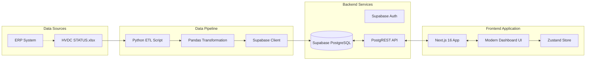
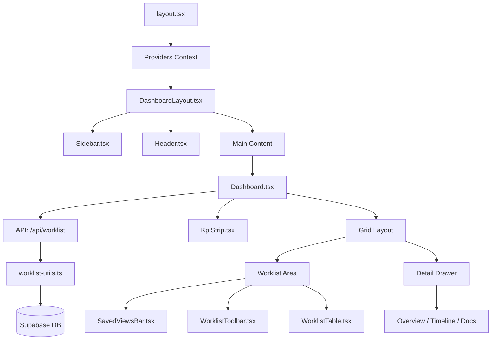
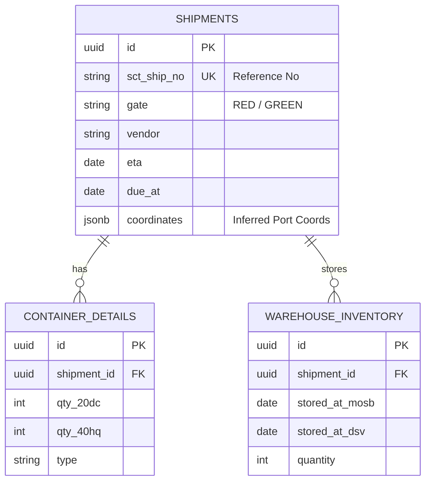
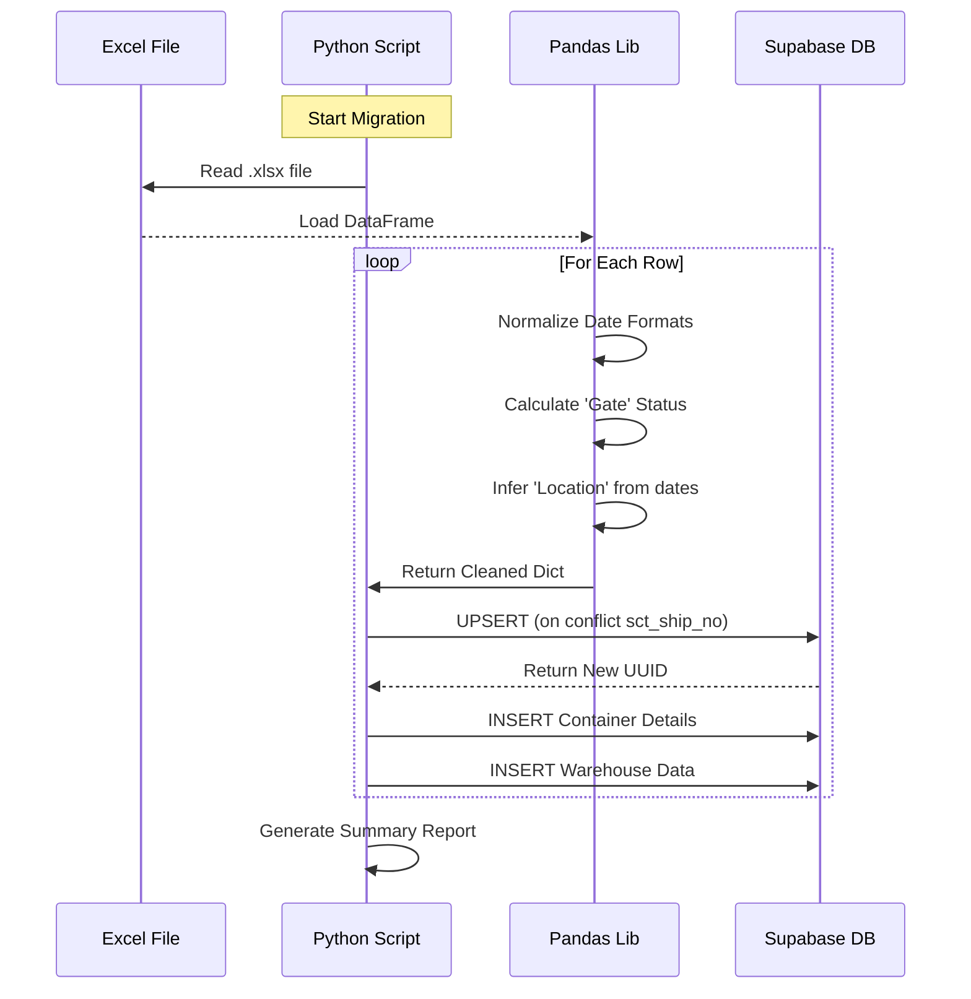

# HVDC Logistics Dashboard - System Architecture

## 1. Executive Summary

The **HVDC Logistics Dashboard** is a mission-critical "Control Tower" application designed for Samsung C&T's HVDC Lightning Project. It provides real-time visibility into international logistics, integrating data from ERP systems (Excel exports) into a centralized, interactive web interface.

The system is built on a **Jamstack** architecture, leveraging **Next.js 16** for a responsive frontend, **Supabase** for a scalable serverless backend/database, and **Python** for robust data processing pipelines.

---

## 2. High-Level Architecture (Context View)

This diagram illustrates the macro-level data flow from raw Excel inputs to the end-user dashboard.



---

## 3. Tech Stack

| Layer | Technology | Description |
| :--- | :--- | :--- |
| **Frontend Framework** | **Next.js 16** | App Router, Server Components, React 19. |
| **Language** | **TypeScript** | Strict type safety for all components and stores. |
| **Styling** | **Tailwind CSS 4** | Utility-first CSS, configured for dark/light modes. |
| **State Management** | **Zustand** | Lightweight client-side state (Filters, Selection). |
| **Backend & DB** | **Supabase** | PostgreSQL 15, Auto-generated APIs, RLS Security. |
| **API Routes** | **Next.js API** | `/api/worklist` for dashboard data aggregation. |
| **Map Engine** | **Leaflet / SVG** | Hybrid approach for global route visualization. |
| **ETL & Migration** | **Python 3.10+** | Pandas for data cleaning, normalization, and upsert logic. |

---

## 4. Frontend Architecture (Logical View)

The frontend is structured around the **App Router** pattern, separating layout/shell concerns from business logic.

### 4.1 Component Hierarchy



### 4.2 State Management (Zustand Store)

We use `zustand` to manage **Dashboard State** to avoid prop drilling and ensure instant UI feedback.

*   **Store**: `useDashboardStore`
*   **Slices**:
    *   `rows`: The raw shipment data array.
    *   `filters`: Active filter criteria (Gate, Search Query, Due Date).
    *   `savedViews`: Persisted user-defined views (JSON objects of filters).
    *   `selection`: ID of the currently selected shipment (controls Drawer).
    *   `ui`: Draw open/close state, active tab.

---

## 5. Backend & Database Architecture

The backend relies on Supabase, which provides a production-ready PostgreSQL database and auto-generated RESTful APIs.

### 5.1 Entity Relationship Diagram (ERD)



### 5.2 Security Policies (RLS)
Row Level Security is enabled to protect sensitive logistics data.
*   **Anon (Public)**: Read-only access to non-sensitive dashboard stats (optional).
*   **Authenticated**: Full Read/Write access for authorized logistics operations teams.
*   **Service Role**: Used by Python ETL script for bulk `UPSERT` operations.

---

## 6. Data Pipeline (ETL Process)

The Python script (`scripts/hvdc_migration_script.py`) is the bridge between the legacy Excel workflow and the modern digital system.

### 6.1 ETL Flow Sequence



---

## 7. API Architecture

### 7.1 Worklist API Endpoint

The `/api/worklist` endpoint provides aggregated dashboard data:

```typescript
GET /api/worklist
Response: {
  lastRefreshAt: string,  // Asia/Dubai timezone timestamp
  kpis: {
    driAvg: number,
    wsiAvg: number,
    redCount: number,
    overdueCount: number,
    recoverableAED: number,
    zeroStops: number
  },
  rows: WorklistRow[]
}
```

**Key Features**:
- Fetches shipments from Supabase with warehouse inventory join
- Converts DB rows to WorklistRow format using `worklist-utils.ts`
- Calculates KPIs using `calculateKpis()` function
- Uses Asia/Dubai timezone for all date comparisons
- Provides fallback data on errors to ensure UI stability

### 7.2 Timezone Handling

All date operations use **Asia/Dubai** timezone for consistency:
- `getDubaiToday()`: Returns today's date in YYYY-MM-DD format
- `getDubaiTimestamp()`: Returns current timestamp in YYYY-MM-DD HH:mm format
- Date comparisons in filters and KPI calculations use Dubai timezone

---

## 8. Deployment Strategy

*   **Development**: Local Node.js server (Port `3001`) proxying to remote Supabase.
*   **Production** (Planned):
    *   **Frontend**: Vercel (recommended for Next.js) or Docker Container on AWS ECS.
    *   **Database**: Managed Supabase instance (Cloud).
    *   **CI/CD**: GitHub Actions to trigger build on `main` branch push.

---
© 2026 Samsung C&T HVDC Project Team
