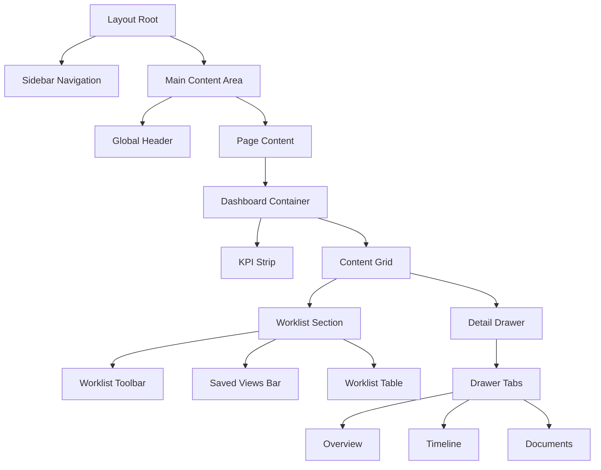

# HVDC Logistics Dashboard - UI/UX Design Document

## 1. Design Philosophy
**"Modern Enterprise Cockpit"**
The design prioritizes operational efficiency, information density, and clarity. It moves away from simple consumer-style layouts to a robust professional tool.

### Core Principles
-   **Sidebar Navigation**: Persistent, clear navigation for deep application structures.
-   **Worklist-Centric**: The "Worklist" is the heart of operations. Users scan list rows, not just abstract charts.
-   **Detail-on-Demand**: Clicking a row opens a "Drawer" (Side Panel) to show details without losing context of the list.
-   **Visual Signals**: "Gate" colors (Red/Amber/Green) and "Triggers" (Badges) provide immediate status cues.

## 2. Component Hierarchy

## 3. Key Components

### 3.1 Layout (`src/components/layout`)
-   **Sidebar**: Dark themed (`bg-slate-900`), collapsible. Links to Dashboard, Shipments, Analytics.
-   **Header**: Sticky top, glassmorphism (`bg-white/80 backdrop-blur`). Contains Global Search (`Cmd+K`) and Notifications.

### 3.2 Dashboard (`src/components/dashboard`)
-   **WorklistTable**:
    -   **Gate Column**: Color-coded chips (RED: Action Req, GREEN: On Track).
    -   **Triggers**: Specific missing items (e.g., "DO_MISSING").
    -   **Smart Sort**: Prioritizes problematic shipments (Red Gate > Overdue).
-   **DetailDrawer**:
    -   **Context**: Shows details of the selected shipment side-by-side with the list.
    -   **Tabs**: Organized info (Overview, Timeline, Docs, Cost).
-   **KpiStrip**: High-level metrics (DRI Score, Red Count) displayed at the top.

### 3.3 State Management (Zustand)
-   **Store**: `useDashboardStore`
-   **Features**:
    -   Filter state (Gate, RowKind, Owner, Search).
    -   "Saved Views": Users can save current filter sets as quick presets (e.g., "Red Gate Only").
    -   Selection state (Selected Row ID, Drawer Open/Close).

## 4. Visual Style
-   **Color Palette**:
    -   **Primary**: Slate-900 (Sidebar), Blue-600 (Accents/Active Links).
    -   **Status**: Red-600 (Critical), Amber-500 (Warning), Emerald-600 (Good).
    -   **Background**: Slate-50 (App Background), White (Cards).
-   **Typography**: Inter (via `next/font/google`). Clean, legible, tabular nums for data.

## 5. Mobile Experience
-   **Responsive Layout**:
    -   Sidebar becomes a Hamburger menu (or hidden).
    -   Detail Drawer becomes an **Overlay** sliding from bottom/right.
    -   Table adjusts to card-like view or horizontal scroll.
