# System Architecture

**Last Updated**: 2026-01-25  
**Reference**: [AGENTS.md](../AGENTS.md), [INTEGRATION_STATUS.md](./INTEGRATION_STATUS.md), [DATA_LOADING_PLAN.md](./DATA_LOADING_PLAN.md), [REALTIME_IMPLEMENTATION.md](./REALTIME_IMPLEMENTATION.md), [DASH_PLAN.md](./DASH_PLAN.md)

---

## Executive Summary

통합 대시보드는 **HVDC Dashboard**와 **Logistics Dashboard**를 단일 웹 애플리케이션으로 통합한 **Control Tower** 시스템입니다. Supabase를 SSOT로 사용하며, 실시간 KPI 대시보드와 지도 기반 물류 시각화를 제공합니다.

**핵심 아키텍처**: MapView (left) + RightPanel (right) + HVDC Panel (bottom)

**주요 성과** (2026-01-25):
- ✅ Realtime KPI Dashboard 구현 완료 (Supabase Realtime 기반)
- ✅ ETL 파이프라인 준비 완료 (Status/Case 레이어)
- ✅ Flow Code v3.5 통합 완료
- ✅ 통합 레이아웃 프로토타입 완료
- ✅ **맵 레이어 API 라우트 Supabase 전환 완료** (Mock → 실제 데이터 조회)
- ✅ **dash 패치 적용 완료** (POI 레이어, StageCardsStrip, GlobalSearch)

---

## 1. 시스템 개요

### 1.1 전체 시스템 아키텍처

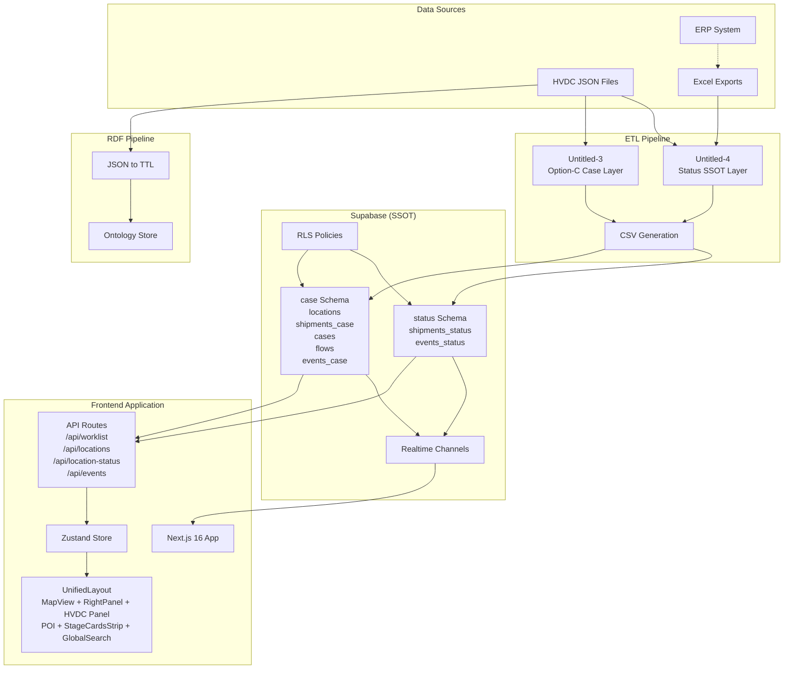

### 1.2 아키텍처 원칙

1. **Supabase as SSOT**: 모든 운영 데이터의 단일 저장소
2. **RDF 파이프라인 유지**: HVDC JSON → RDF(Turtle) 변환 보존
3. **정규화된 테이블**: 프론트엔드 친화적 접근을 위한 Supabase 테이블
4. **통합 UX**: 데스크톱 + 모바일(PWA) 최적화
5. **접근성**: WCAG 2.2 AA 준수
6. **Realtime First**: Supabase Realtime 기반 실시간 업데이트 (폴백 폴링)

### 1.3 기술 스택

**Frontend**:
- Next.js 16.1.1 (App Router)
- React 19.2.3, TypeScript 5.9.3
- Zustand 5.0.9 (상태 관리)
- Tailwind CSS 4

**Maps**:
- maplibre-gl 5.15.0
- deck.gl 9.2.5

**Backend**:
- Supabase (PostgreSQL 15 + RLS + Auth + Realtime + Edge Functions)

**ETL**:
- Python 3.13
- pandas, numpy

**Testing**:
- jest + testing-library

**Deployment**:
- Vercel

---

## 2. 데이터 플로우 아키텍처

### 2.1 전체 데이터 플로우

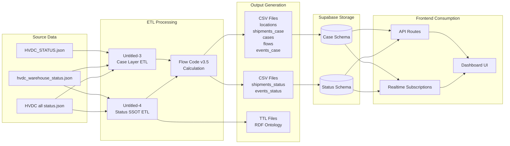

### 2.2 ETL 파이프라인 상세

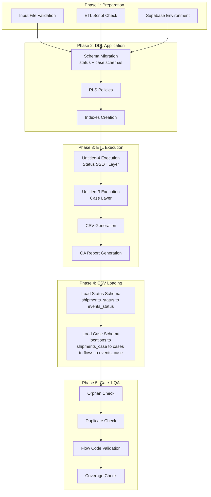

---

## 3. 레이어 아키텍처

### 3.1 프론트엔드 레이어

```mermaid
graph TB
    subgraph "Presentation Layer"
        MapView[MapView Component<br/>deck.gl + maplibre-gl]
        RightPanel[RightPanel Component<br/>Location Status]
        HVDCPanel[HVDC Panel Component<br/>KPI + Worklist + DetailDrawer]
    end

    subgraph "State Management Layer"
        UnifiedStore[UnifiedStore Zustand<br/>Location Selection<br/>Worklist Filtering<br/>KPI State]
    end

    subgraph "API Layer"
        WorklistAPI[/api/worklist<br/>Dashboard Payload]
        LocationsAPI[/api/locations<br/>Supabase public.locations]
        LocationStatusAPI[/api/location-status<br/>Supabase public.location_statuses]
        EventsAPI[/api/events<br/>Supabase public.events<br/>with joins]
    end

    subgraph "Data Layer"
        SupabaseClient[Supabase Client<br/>Postgres RLS<br/>Realtime Subscriptions]
    end

    MapView --> UnifiedStore
    RightPanel --> UnifiedStore
    HVDCPanel --> UnifiedStore

    UnifiedStore --> WorklistAPI
    UnifiedStore --> LocationsAPI
    UnifiedStore --> LocationStatusAPI
    UnifiedStore --> EventsAPI

    WorklistAPI --> SupabaseClient
    LocationsAPI --> SupabaseClient
    LocationStatusAPI --> SupabaseClient
    EventsAPI --> SupabaseClient
```

### 3.2 백엔드 레이어

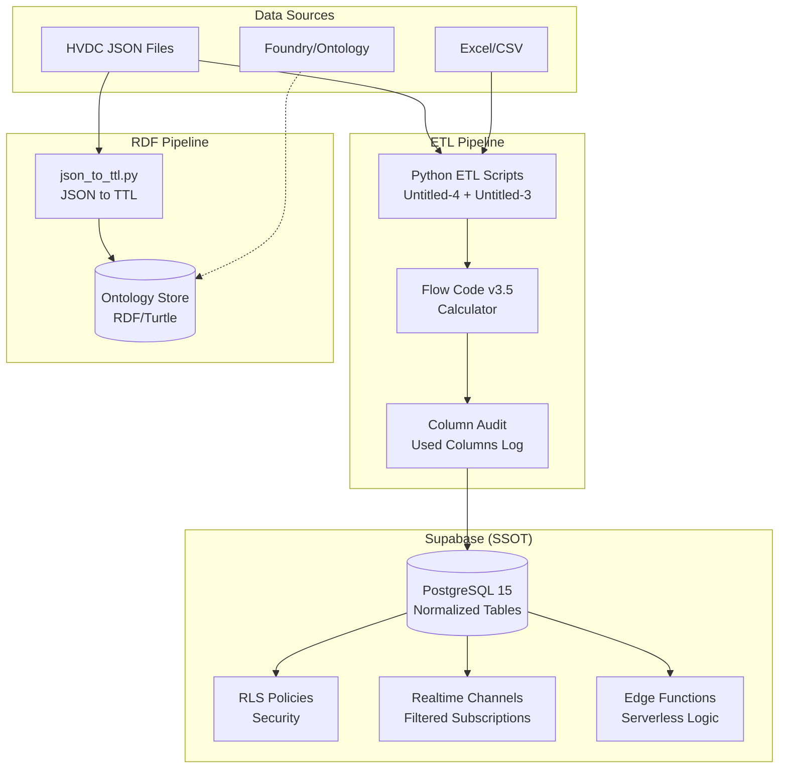

---

## 4. 데이터 모델

### 4.1 Supabase 스키마 구조

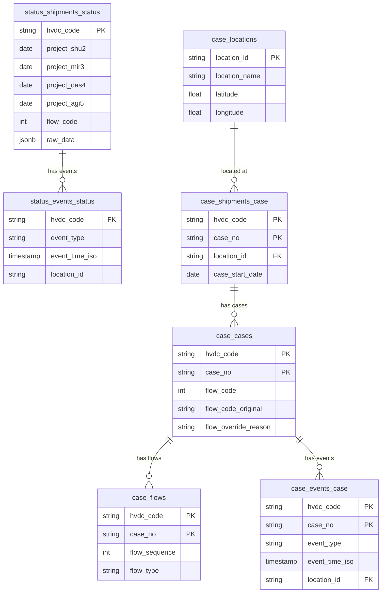

### 4.2 데이터 레이어 구조

**Status SSOT Layer** (`status` schema):
- `status.shipments_status`: Status 전량 기준 선적 마스터
- `status.events_status`: Status 레이어 이벤트

**Option-C Case Layer** (`case` schema):
- `case.locations`: 물류 위치 마스터
- `case.shipments_case`: 케이스 단위 선적
- `case.cases`: 케이스 마스터 (Flow Code 포함)
- `case.flows`: 케이스 흐름
- `case.events_case`: 케이스 이벤트

**Core Tables** (`public` schema):
- `locations`: 물류 위치 (포트, 창고, 현장)
  - 컬럼: `id` (UUID), `name`, `lat`, `lng`, `type`
  - API 매핑: `id→location_id`, `lng→lon`, `type→siteType`
- `location_statuses`: 위치별 실시간 상태
  - 컬럼: `location_id` (UUID FK), `status` (text), `occupancy_rate` (0-100), `updated_at`
  - API 매핑: `status→status_code` (대문자), `occupancy_rate` (0-100→0-1), `updated_at→last_updated`
- `events`: 이벤트 로그
  - 컬럼: `id` (UUID), `location_id` (UUID FK), `shipment_id` (UUID FK), `event_type`, `description`, `metadata`, `ts`
  - API 조인: `locations!inner` (좌표 필수), `shipments` (선택적)
  - API 매핑: `event_type→status`, `description→remark`, `shipments.sct_ship_no→shpt_no`
- `hvdc_kpis`: HVDC KPI 메트릭
- `hvdc_worklist`: HVDC 워크리스트
- `logs`: 시스템 로그 (pipeline/audit)

### 4.3 RDF 온톨로지

**Namespace**: `http://samsung.com/project-logistics#`

**Core Properties**:
- `hvdc:hasSiteArrivalDate` (generic)
- `hvdc:hasSHUArrivalDate`, `hvdc:hasMIRArrivalDate`, `hvdc:hasDASArrivalDate`, `hvdc:hasAGIArrivalDate` (site-specific)
- `hvdc:hasSiteArrival` (derived boolean)
- `hvdc:hasFlowCode` (0-5)
- `hvdc:hasFinalLocation`

**Event Model**:
- `hvdc:StockEvent` (이벤트 클래스)
- `hvdc:hasInboundEvent`, `hvdc:hasOutboundEvent`
- `hvdc:hasEventDate`, `hvdc:hasLocationAtEvent`

---

## 5. 컴포넌트 아키텍처

### 5.1 통합 레이아웃 구조

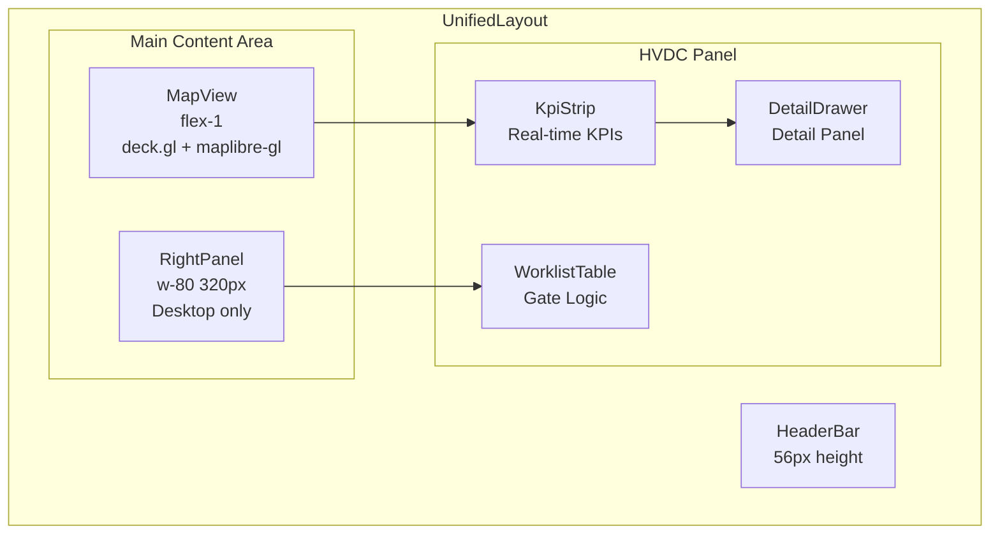

### 5.2 컴포넌트 계층 구조

```mermaid
graph TD
    UnifiedLayout[UnifiedLayout.tsx]
    
    UnifiedLayout --> HeaderBar[HeaderBar]
    UnifiedLayout --> MapView[MapView Component]
    UnifiedLayout --> RightPanel[RightPanel Component]
    UnifiedLayout --> HVDCPanel[HVDC Panel Component]
    
    MapView --> LocationLayer[Location Layer<br/>deck.gl ScatterplotLayer]
    MapView --> HeatmapLayer[Heatmap Layer<br/>deck.gl HeatmapLayer]
    MapView --> GeofenceLayer[Geofence Layer<br/>deck.gl PathLayer]
    MapView --> ETAWedgeLayer[ETA Wedge Layer<br/>deck.gl ArcLayer]
    MapView --> PoiLayer[POI Layer<br/>deck.gl ScatterplotLayer + TextLayer<br/>11개 고정 POI, reakmapping SSOT]
    
    RightPanel --> LocationStatus[Location Status Card]
    RightPanel --> EventList[Event List]
    RightPanel --> OccupancyChart[Occupancy Rate Chart]
    
    HVDCPanel --> StageCardsStrip[StageCardsStrip<br/>3카드, 라우팅 연동]
    HVDCPanel --> KpiStrip[KpiStrip Component]
    HVDCPanel --> WorklistTable[WorklistTable Component]
    HVDCPanel --> DetailDrawer[DetailDrawer Component]
    
    HeaderBar --> GlobalSearch[GlobalSearch<br/>locations·worklist 검색]
    
    KpiStrip --> KpiCard1[Total Shipments]
    KpiStrip --> KpiCard2[In Transit]
    KpiStrip --> KpiCard3[At Site]
    KpiStrip --> KpiCard4[Delivered]
    
    WorklistTable --> WorklistRow[WorklistRow Component]
    WorklistTable --> FilterBar[FilterBar Component]
    WorklistTable --> SearchBar[SearchBar Component]
```

### 5.3 상태 관리 구조

**UnifiedStore (Zustand)**:
```typescript
interface UnifiedStore {
  // Logistics
  locations: Record<string, Location>
  locationStatuses: Record<string, LocationStatus>
  events: Record<string, Event>
  
  // HVDC
  worklistRows: WorklistRow[]
  kpis: KPIs
  filters: DashboardFilters
  
  // UI State
  selectedLocationId?: string
  selectedRowId?: string
  drawerOpen: boolean
  
  // Realtime State
  connectionStatus: 'live' | 'polling' | 'offline'
  lastUpdateTime?: Date
  
  // Actions
  selectLocation: (id: string) => void  // → HVDC 필터링
  selectWorklistRow: (id: string) => void  // → 지도 하이라이트
  updateKpis: (kpis: KPIs) => void  // Realtime 업데이트
}
```

---

## 6. Realtime 아키텍처

### 6.1 Realtime KPI Dashboard 구조

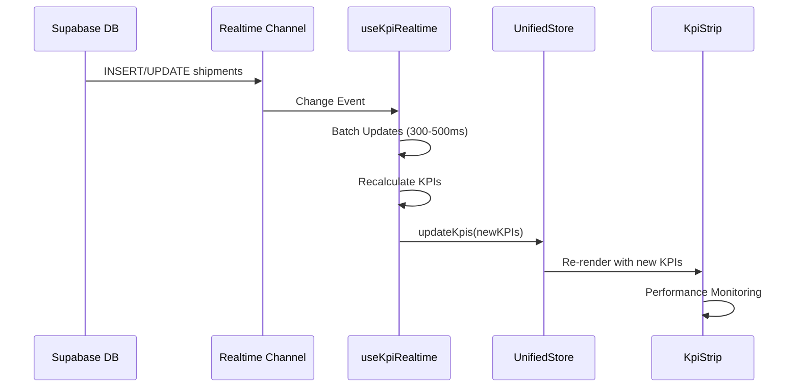

### 6.2 Realtime 훅 구조

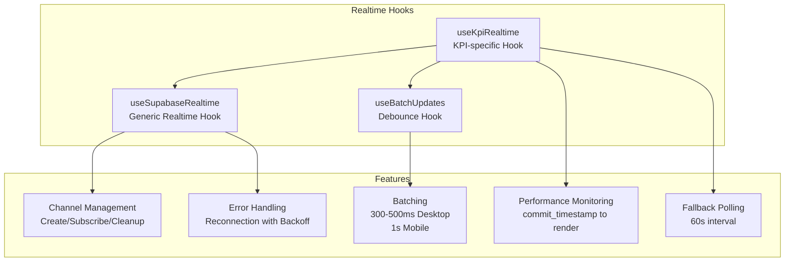

### 6.3 Realtime 채널 구조

**Channels**:
- `public.shipments`: 선적 업데이트 (KPI 재계산 트리거)
- `status.shipments_status`: Status 레이어 업데이트
- `status.events_status`: Status 이벤트 스트림
- `case.shipments_case`: Case 레이어 선적 업데이트
- `case.events_case`: Case 이벤트 스트림
- `case.cases`: 케이스 업데이트 (Flow Code 변경)

**Optimization**:
- Filtered channels (필요한 데이터만 구독)
- Minimal payload (최소 페이로드)
- Merge/debounce (중복 제거)
- UI virtualization (대용량 리스트 가상화)
- Visibility change handling (모바일 최적화)

---

## 7. API 아키텍처

### 7.1 REST API (Next.js API Routes)

**HVDC APIs**:
- `GET /api/worklist`: 대시보드 페이로드 (KPI + WorklistRows)
- `GET /api/shipments`: 선적 목록
- `GET /api/statistics`: 통계 데이터
- `GET /api/alerts`: 알림
- `GET /api/weather`: 날씨 정보

**Logistics APIs**:
- `GET /api/locations`: 물류 위치 목록
  - **데이터 소스**: Supabase `public.locations` (Fallback: Mock 데이터)
  - **스키마 매핑**: `id→location_id`, `lng→lon`, `type→siteType` (매핑 함수)
  - **필터**: 좌표가 있는 행만 반환
- `GET /api/location-status`: 위치별 상태
  - **데이터 소스**: Supabase `public.location_statuses` (Fallback: Mock 데이터)
  - **스키마 매핑**: `status→status_code` (대문자 변환), `occupancy_rate` (0-100→0-1), `updated_at→last_updated`
- `GET /api/events`: 이벤트 로그
  - **데이터 소스**: Supabase `public.events` with `locations!inner` + `shipments` joins (Fallback: Mock 데이터)
  - **스키마 매핑**: `event_type→status`, `description→remark`, `shipments.sct_ship_no→shpt_no`
  - **필터**: 유효한 좌표가 있는 이벤트만 반환

### 7.2 API 데이터 플로우

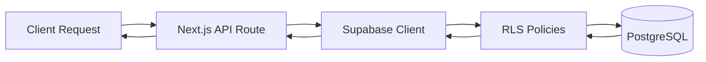

---

## 8. 보안 아키텍처

### 8.1 인증/인가

- **Client**: anon key + RLS policies
- **Server/Edge**: service role key (절대 클라이언트 노출 금지)

### 8.2 Row Level Security (RLS)

**원칙**:
- 모든 테이블에 RLS 활성화 필수
- 명시적 정책 정의
- RLS 정책은 제품 계약으로 취급 (약화 금지)

**RLS 정책 구조**:
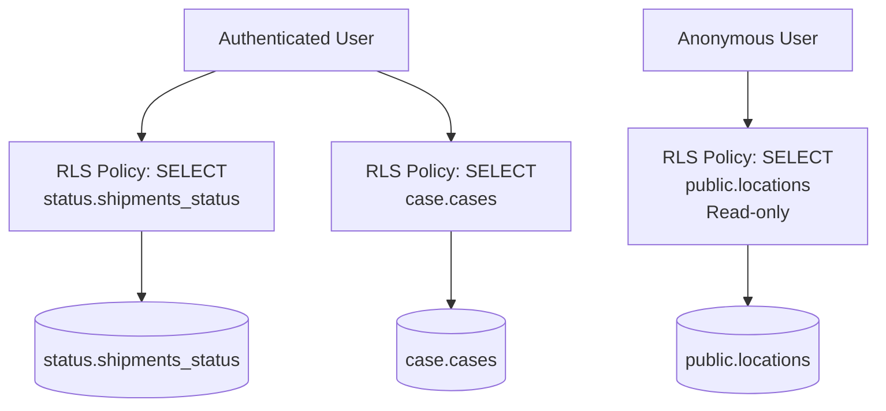

### 8.3 데이터 보호

- 환경 변수로만 비밀값 관리
- 로그에서 비밀값 제거
- 문서 무결성: doc_hash + 엄격한 접근 제어
- 불변 감사 로그 (who/when/why)

---

## 9. 성능 아키텍처

### 9.1 성능 목표 (Gate 3)

- 평균 응답 시간 < 1s
- p95 < 3s (워크리스트 로드, 상태 패널 새로고침)
- Realtime latency p95 < 3s
- Sync lag p95 ≤ 300s

### 9.2 최적화 전략

**Frontend**:
- Skeleton loading (점진적 로딩)
- Virtualization (대용량 리스트)
- Realtime merge/debounce (중복 제거)
- React.useTransition (비긴급 업데이트)

**Backend**:
- Cursor-based pagination (updated_at, event_ts)
- Indexes on cursor fields
- Realtime filtered channels
- Batch updates (300-500ms desktop, 1s mobile)

**Integration**:
- Sync lag p95 ≤ 300s
- Validation latency p95 < 5s

---

## 10. 통합 패턴

### 10.1 Supabase ↔ Foundry/Ontology

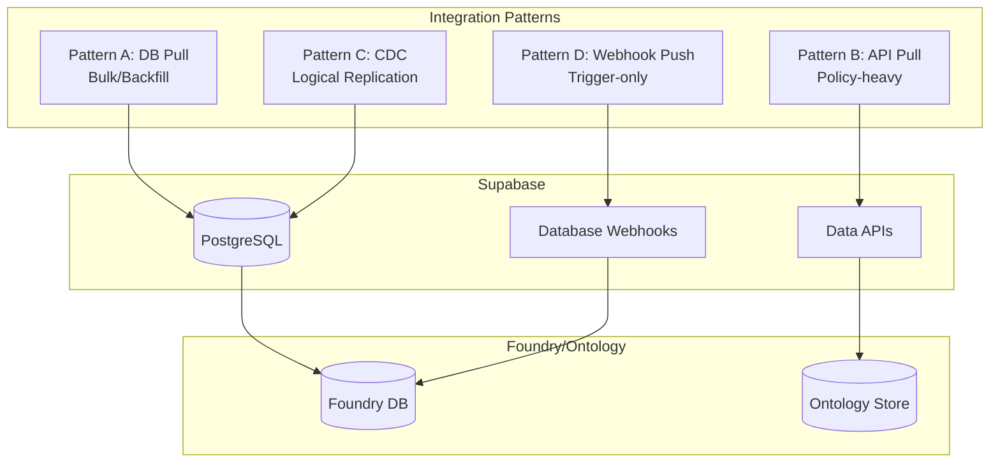

**패턴 A: DB Pull** (bulk/backfill)
- Postgres 직접 연결
- 읽기 전용 DB role
- Cursor-based incremental loads

**패턴 B: API Pull** (policy-heavy)
- Supabase Data APIs / REST
- RLS-aware
- Signed JWT + RLS policies

**패턴 C: CDC** (ops-mature)
- Logical Replication
- Outbox table (stable change envelopes)
- Idempotent + checkpointed

**패턴 D: Webhook Push** (trigger-only)
- Database Webhooks
- Thin webhook, fat pull
- Retry/backoff + dead-letter

**권장**: (A)+(D) 또는 (B)+(D)

---

## 11. 검증 아키텍처

### 11.1 Gate 1 QA 검증

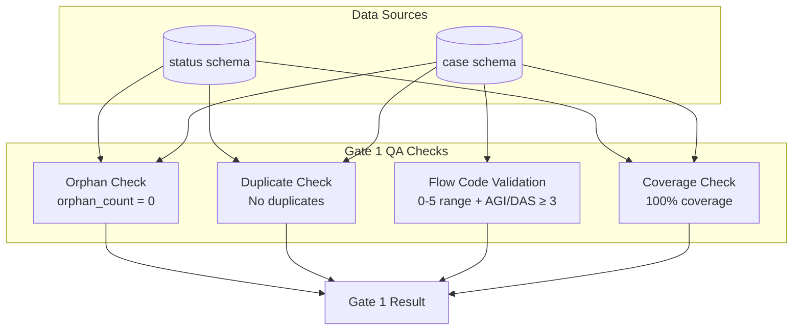

### 11.2 SHACL 검증

**규칙**:
- Flow Code ∈ [0..5] + domain routing rules
- Invoice math integrity (EA×Rate = Amount, ΣLine = InvoiceTotal)
- Site Arrival Date datatype (xsd:date)
- Boolean-date consistency
- AGI/DAS Flow ≥ 3 constraint
- Chronology (ETD ≤ ATD ≤ ATA)

### 11.3 OCR 게이트

**임계값**:
- MeanConf ≥ 0.92
- TableAcc ≥ 0.98
- NumericIntegrity = 1.00

**Fail-safe**: 게이트 실패 시 ZERO 모드 (downstream automation 중지 + 티켓)

---

## 12. 배포 아키텍처

### 12.1 배포 환경

- **Platform**: Vercel
- **Database**: Supabase (PostgreSQL)
- **CDN**: Vercel Edge Network
- **Monitoring**: Vercel Analytics + Supabase Dashboard

### 12.2 CI/CD 파이프라인

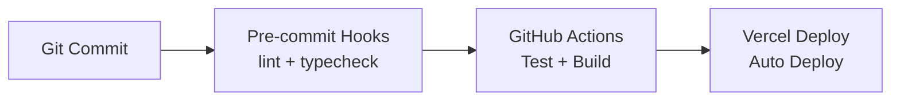

---

## 13. 참조 문서

- [AGENTS.md](../AGENTS.md) - 프로젝트 규칙
- [INTEGRATION_STATUS.md](./INTEGRATION_STATUS.md) - 통합 상태
- [DATA_LOADING_PLAN.md](./DATA_LOADING_PLAN.md) - 🆕 Supabase 데이터 적재 작업 계획
- [REALTIME_IMPLEMENTATION.md](./REALTIME_IMPLEMENTATION.md) - 🆕 Realtime KPI Dashboard 구현
- [DASHBOARD_LAYOUT.md](./DASHBOARD_LAYOUT.md) - 🆕 통합 대시보드 레이아웃 사양
- [ETL_GUIDE.md](./ETL_GUIDE.md) - 🆕 ETL 스크립트 가이드
- [plan.md](../plan.md) - TDD 테스트 계획

---

**문서 버전**: 2.1  
**최종 업데이트**: 2026-01-25  
**주요 변경사항**:
- Realtime KPI Dashboard 구현 완료 반영
- Data Loading & ETL 파이프라인 추가
- Status/Case 레이어 구조 반영
- **맵 레이어 API 라우트 Supabase 전환 완료** (Mock → 실제 데이터 조회, 스키마 매핑, Fallback 로직)
- **dash 패치 적용 완료** (POI 레이어, StageCardsStrip, GlobalSearch)
- 머메이드 다이어그램 추가 (시스템 아키텍처, 데이터 플로우, ETL 파이프라인, 컴포넌트 구조, Realtime 아키텍처)
