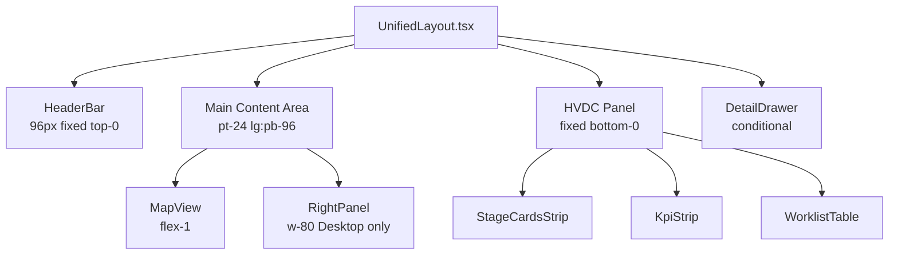

# 컴포넌트 상세 사양

> **최종 업데이트**: 2026-02-07  
> **참조**: [COMPONENT_SPEC.md](../../.cursor/skills/unified-dashboard-ui/references/COMPONENT_SPEC.md), [DASHBOARD_LAYOUT.md](./DASHBOARD_LAYOUT.md)

---

## 목차

1. [UnifiedLayout](#unifiedlayout)
2. [HeaderBar](#headerbar)
3. [MapView](#mapview)
4. [RightPanel](#rightpanel)
5. [HVDC Panel](#hvdc-panel)
6. [DetailDrawer](#detaildrawer)
7. [공통 컴포넌트](#공통-컴포넌트)

---

## UnifiedLayout

### 파일 위치
`apps/logistics-dashboard/components/UnifiedLayout.tsx`

### 역할
통합 대시보드의 최상위 레이아웃 컨테이너로, 모든 주요 패널을 조율합니다.

### 레이아웃 구조



### Props
없음 (클라이언트 컴포넌트, 내부 상태 관리)

### 상태 관리

**Zustand Store** (`@repo/shared`):
- `useOpsActions()`: 액션 함수들
- `useWorklistRows()`: 워크리스트 행 데이터
- `useSelectedCaseId()`: 선택된 케이스 ID
- `useDrawerOpen()`: DetailDrawer 열림/닫힘 상태

**로컬 상태**:
- `panelHeight`: 모바일 HVDC Panel 높이 (200-600px)
- `mapDataLoadDone`: Map 데이터 로드 완료 플래그

### 데이터 로딩

**초기 로드 순서**:
1. `useInitialDataLoad`: Worklist/KPI 데이터 먼저 로드
2. `useEffect`: Map 데이터 (locations, statuses, events) 별도 로드
3. `useLiveFeed`: Realtime 구독 (KPI는 `useKpiRealtime` 사용)

### 레이아웃 상수

```typescript
const MIN_PANEL_HEIGHT = 200    // 모바일 최소 높이
const MAX_PANEL_HEIGHT = 600    // 모바일 최대 높이
const DEFAULT_PANEL_HEIGHT = 260 // 기본 높이
```

### 모바일 드래그 제스처

**드래그 핸들**:
- 위치: HVDC Panel 상단 중앙
- 스타일: `h-1 w-12 bg-border rounded-full`
- 이벤트: `onMouseDown`, `onTouchStart`
- 키보드: Enter/Space로 토글 (최소/기본 높이)

**드래그 로직**:
- `handlePanelDragStart`: 드래그 시작, 초기 Y 좌표 및 높이 저장
- `handlePanelDragMove`: 드래그 중, 높이 계산 및 클램핑
- `handlePanelDragEnd`: 드래그 종료, 이벤트 리스너 제거

### 접근성

- **ESC 키**: DetailDrawer 닫기
- **ARIA 레이블**: 
  - `role="main"`, `aria-label="Logistics Map View"` (MapView)
  - `aria-label="Location Status Panel"` (RightPanel)
  - `aria-label="HVDC Worklist Panel"` (HVDC Panel)

---

## HeaderBar

### 파일 위치
`apps/logistics-dashboard/components/dashboard/HeaderBar.tsx`

### 구조

**2-row layout (96px 높이)**:

#### 상단 행
- **제목**: "MOSB Logistics Dashboard"
- **상태 배지**: "Client-Only Mode"
- **연결 상태**: LIVE ON/OFF (Radio 아이콘)
- **GlobalSearch**: locations·worklist 검색 (xl:block)
- **토글**: Geofence, Heatmap, ETA Wedge
- **입력**: Window (hours), Heat Filter (All/OK/WARNING/CRITICAL)
- **사용자 메뉴**: 사용자 정보, Logout 버튼

#### 하단 행
- **KPI 요약 스트립**: 고정, `aria-live="polite"`
- **배지**: Shipments, Planned, In-Transit, Arrived, Delayed, Hold, Unknown, Events

### KPI 계산 로직

```typescript
// Window 기반 이벤트 필터링
const windowMs = windowHours * 60 * 60 * 1000
const now = Date.now()
const eventsInWindow = events.filter(
  evt => now - new Date(evt.ts).getTime() <= windowMs
)

// 상태별 카운팅
status.includes("PLAN") → planned++
status.includes("TRANSIT") → inTransit++
status.includes("DELIVER") || status.includes("ARRIV") → arrived++
status.includes("DELAY") → delayed++
status.includes("HOLD") → hold++
```

### GlobalSearch

**검색 인덱스**:
- Worklist rows (shipments, cases)
- POI locations

**검색 결과 처리**:
- `type === "shipment"`: `?focus=<hvdc_code>`
- `type === "case"`: `?case=<case_no>`
- `type === "location"`: `?loc=<poi_code>`

### 스타일

- **배경**: `bg-card/95 backdrop-blur-sm`
- **테두리**: `border-b border-border`
- **Z-index**: `z-50` (최상위)
- **고정**: `fixed top-0 left-0 right-0`

---

## MapView

### 파일 위치
`apps/logistics-dashboard/components/map/MapView.tsx`

### 라이브러리

- **maplibre-gl**: 5.15.0 (베이스 맵)
- **deck.gl**: 9.2.5 (레이어 렌더링)
- **@deck.gl/mapbox**: MapboxOverlay 통합

### 초기 뷰

```typescript
const INITIAL_VIEW = {
  longitude: 54.4,  // Abu Dhabi region center
  latitude: 24.5,
  zoom: 8
}

const POI_BOUNDS: maplibregl.LngLatBoundsLike = [
  [52.57, 24.12],
  [54.65, 25.15]
]
```

### 레이어 가시성 임계값

```typescript
const MAP_LAYER_ZOOM_THRESHOLDS = {
  heatmapMax: 9.5,      // Heatmap: 줌 < 9.5
  statusMin: 9.5,       // Location Status: 줌 >= 9.5
  poiMin: 7.5,         // POI 마커: 줌 >= 7.5
  poiLabelMin: 7.5,    // POI 라벨 시작: 줌 >= 7.5
  poiDetailMin: 10.5   // POI 상세 라벨: 줌 >= 10.5
}
```

### 레이어 상세

#### 1. Location Layer
- **타입**: deck.gl ScatterplotLayer
- **표시 조건**: `zoom >= 9.5`
- **데이터**: `locationsById` (Zustand store)
- **스타일**: 상태별 색상 (OK/WARNING/CRITICAL)
- **인터랙션**: 호버 시 툴팁

#### 2. Heatmap Layer
- **타입**: deck.gl HeatmapLayer
- **표시 조건**: `showHeatmap && zoom < 9.5`
- **데이터**: `eventsInWindow` (Window 필터링된 이벤트)
- **가중치**: 지오펜스 내부 이벤트 2배 가중치
- **반경**: 줌 레벨에 따라 스케일링
  - 줌 >= 12: 40px
  - 줌 >= 9: 60px
  - 줌 < 9: 80px
- **색상 범위**: `HEATMAP_COLOR_RANGE` (6단계)

#### 3. HeatmapLegend
- **위치**: `absolute left-4 bottom-4`
- **표시 조건**: `showHeatmapLayer === true`
- **내용**: 6단계 강도 범례 (낮음~매우 높음)
- **접근성**: `role="group"`, `aria-label="Heatmap intensity legend"`

#### 4. Geofence Layer
- **타입**: deck.gl PathLayer
- **표시 조건**: `showGeofence` (토글 기반)
- **데이터**: `createGeofenceGeojson(locations)`
- **스타일**: 경계선 표시

#### 5. ETA Wedge Layer
- **타입**: deck.gl ArcLayer
- **표시 조건**: `showEtaWedge` (토글 기반)
- **데이터**: ETA 예측 데이터

#### 6. POI Layer
- **타입**: deck.gl ScatterplotLayer + TextLayer
- **표시 조건**: `zoom >= 7.5`
- **데이터**: `POI_LOCATIONS` (11개 고정 POI)
- **라벨 모드**:
  - **컴팩트** (줌 7.5~10.5): 코드만 표시
  - **상세** (줌 >= 10.5): 전체 라벨 표시
- **강조 POI**: MOSB yard 등 특정 POI 라벨 크기 증가

### 인터랙션

**클릭**:
- Location 선택 → Worklist 필터 적용
- POI 선택 → 툴팁 표시

**호버**:
- **Location 툴팁**:
  - 위치: 마우스 좌표 + 10px 오프셋
  - 내용: 위치명, 점유율, 상태, 마지막 업데이트 시간
  - 스타일: `bg-card/95 backdrop-blur-sm`, 최대 너비 250px
- **POI 툴팁**:
  - 위치: 마우스 좌표 + 10px 오프셋
  - 내용: POI 정보 텍스트 (`getPoiTooltip` 함수로 생성)
  - 스타일: `whitespace-pre-line` (줄바꿈 지원)

**줌/팬**:
- 표준 지도 제스처
- 줌 변경 시 레이어 가시성 자동 업데이트

### 상태 관리

**Zustand Store**:
- `locationsById`: 위치 데이터
- `locationStatusesById`: 위치별 상태
- `eventsById`: 이벤트 데이터

**로컬 상태**:
- `tooltip`: 툴팁 정보 (`TooltipInfo` 타입: location 또는 poi)
- `selectedPoiId`: 선택된 POI ID
- `zoom`: 현재 줌 레벨

**레이어 생성 함수**:
- `createLocationLayer`: Location ScatterplotLayer 생성
- `createHeatmapLayer`: HeatmapLayer 생성 (가중치, 반경 옵션)
- `createGeofenceLayer`: Geofence PathLayer 생성
- `createEtaWedgeLayer`: ETA ArcLayer 생성
- `createPoiLayers`: POI ScatterplotLayer + TextLayer 생성
- `createHvdcPoiLayers`: HVDC POI 레이어 생성
- `getPoiTooltip`: POI 툴팁 텍스트 생성

---

## RightPanel

### 파일 위치
`apps/logistics-dashboard/components/dashboard/RightPanel.tsx`

### 구조

**탭 UI** (3개 탭):

#### Status 탭
- **Location Status 목록**: 
  - 위치별 상태 카드 (Card 컴포넌트)
  - 각 카드 내용:
    - 위치 이름 (truncate)
    - 마지막 업데이트 시간 (Dubai 시간대 포맷)
    - 점유율 (퍼센트, mono 폰트)
    - 상태 배지 (OK/WARNING/CRITICAL)
  - 호버 효과: `hover:bg-accent/50`
  - 로딩 상태: Skeleton 컴포넌트 (8개)

#### Occupancy 탭
- **점유율 차트**: Bar Chart (Recharts, 수평 레이아웃)
- **데이터**: 위치별 점유율 (0-100%)
- **차트 설정**:
  - 높이: 160px
  - X축: 0-100 범위
  - Y축: 위치 이름 (약칭, 최대 8자)
  - Tooltip: 전체 위치명, 점유율, 상태 표시
- **색상**: 상태별 색상 적용 (OK: Green, WARNING: Amber, CRITICAL: Red)
- **로딩 상태**: Skeleton 컴포넌트 (h-40)

#### Distribution 탭
- **상태 분포 차트**: Pie Chart (Recharts)
- **데이터**: OK/WARNING/CRITICAL 개수 (값이 0인 항목은 필터링)
- **차트 설정**:
  - 높이: 120px
  - 내부 반지름: 25px
  - 외부 반지름: 45px
  - 패딩 각도: 2도
  - 라벨: `${name}: ${value}` 형식
- **색상**: 
  - OK: Green (#22c55e)
  - WARNING: Amber (#fbbf24)
  - CRITICAL: Red (#ef4444)
- **Tooltip**: 상태명과 개수 표시
- **로딩 상태**: Skeleton 컴포넌트 (h-32)

### 접근성

**탭 네비게이션**:
- `role="tablist"`, `role="tab"`, `role="tabpanel"`
- `aria-controls`, `aria-selected`
- 활성 탭 변경 시 포커스 자동 이동 (`activePanel?.focus()`)

### 필터링

**MOSB-SCT Office 제외**:
```typescript
locations.filter(
  loc => loc.location_id.toLowerCase() !== "loc-mosb-sct-office"
)
```

### 스타일

- **너비**: `w-80` (320px 고정)
- **배경**: `bg-card/95 backdrop-blur-sm`
- **표시**: Desktop only (`lg:block`)

---

## HVDC Panel

### 파일 위치
`apps/logistics-dashboard/components/UnifiedLayout.tsx` (레이아웃), 개별 컴포넌트들

### 구성 요소

#### StageCardsStrip
- **파일**: `apps/logistics-dashboard/components/hvdc/StageCardsStrip.tsx`
- **위치**: HVDC Panel 상단
- **Props**:
  - `rows: ReadonlyArray<WorklistRow>`: 워크리스트 행 데이터
  - `onNavigateBucket: (bucket: HvdcBucket) => void`: 버킷 선택 콜백
  - `className?: string`: 추가 CSS 클래스
- **카드 구성** (3개):
  1. **누적 (Cumulative)**: 현장 입고 (cumulative)
  2. **현재 (Current)**: 통관/창고 (in progress)
  3. **미래 (Future)**: 선적 예정 (planned)
- **기능**:
  - 버킷별 카운트 계산 (`computeBucketCounts`)
  - 클릭 시 URL 파라미터 업데이트 (`?bucket=<bucket>`)
  - Worklist 필터 연동
- **접근성**: `aria-label`로 각 카드 설명 제공

#### KpiStrip
- **파일**: `apps/logistics-dashboard/components/hvdc/KpiStrip.tsx`
- **KPI 항목** (7개):
  1. DRI Avg (평균, 소수점 2자리)
  2. WSI Avg (평균, 소수점 2자리)
  3. Red Count (개수, 정수)
  4. Overdue (개수, 정수)
  5. Recoverable (AED) (금액, 소수점 2자리)
  6. Zero Stops (개수, 정수)
  7. Last Refresh (마지막 새로고침 시간)
- **Realtime**: `useKpiRealtime` 훅으로 실시간 업데이트
- **연결 상태**: `ConnectionStatusBadge` 표시
- **레이아웃**: 반응형 그리드 (`grid-cols-2 md:grid-cols-3 xl:grid-cols-7`)
- **접근성**: `aria-live="polite"`로 KPI 업데이트 알림

#### WorklistTable
- **파일**: `apps/logistics-dashboard/components/hvdc/WorklistTable.tsx`
- **컬럼** (간소화됨):
  - Gate (배지)
  - Title (제목 + 부제목)
  - Due (마감일)
  - Score (점수)
- **제거된 컬럼**: Flow, ETA, Location, Triggers (→ DetailDrawer로 이동)
- **접근성**: 
  - 키보드 네비게이션 (Enter/Space)
  - `aria-label`, `aria-selected`, `tabIndex={0}`
- **최대 행 수**: 200 (가상화 향후 구현)

### 레이아웃

**데스크탑**:
- 위치: `fixed bottom-0 left-0 right-80`
- 높이: `h-80` (Tailwind 클래스는 320px이지만, 실제 컨텐츠는 260px 기준으로 조정)
- 내부 구조:
  - 상단 영역: `p-4 border-b space-y-3` (StageCardsStrip + KpiStrip)
  - 하단 영역: `flex-1 overflow-hidden` (WorklistTable)
- Z-index: `z-40`

**모바일**:
- 위치: `fixed bottom-0 left-0 right-0`
- 높이: 드래그 가능 (200-600px)
- 기본 높이: 260px (`DEFAULT_PANEL_HEIGHT`)
- 스타일: `rounded-t-lg shadow-lg`
- 드래그 핸들: 상단 중앙, `h-1 w-12 bg-border rounded-full`

---

## DetailDrawer

### 파일 위치
`apps/logistics-dashboard/components/hvdc/DetailDrawer.tsx`

### 모드

#### Sidepanel 모드 (데스크탑)
- **위치**: `fixed top-24 right-80 bottom-80 w-96`
- **스타일**: 사이드 패널 형태
- **Z-index**: `z-50`

#### Overlay 모드 (모바일)
- **위치**: `fixed bottom-0 left-0 right-0`
- **높이**: `h-[70vh]` (화면 높이의 70%)
- **스타일**: 모달 형태, 하단에서 슬라이드 업
- **애니메이션**: `transform transition-transform` (translate-y-0 / translate-y-full)
- **배경 오버레이**: `bg-black/40`, 클릭 시 닫기
- **배경 스크롤**: `document.body.style.overflow = "hidden"` (열림 시)

### 내용

**헤더**:
- 제목 (`row.title`)
- 부제목 (`row.subtitle`)
- 닫기 버튼 (overlay 모드만)

**본문**:
- **상세 정보 그리드** (2열, `grid-cols-2 gap-3`):
  - Gate, Flow Code, Score, ETA, Due, Location, Owner, Final
  - 각 항목은 `KV` 컴포넌트로 표시:
    - 라벨: `text-[11px] text-muted-foreground`
    - 값: `font-medium text-foreground`
    - 배경: `bg-muted/40`
- **Triggers 섹션**:
  - 배경: `bg-muted/40`
  - 트리거가 있으면: 배지 형태로 표시 (`flex-wrap gap-1`)
    - 각 배지: `border border-border bg-muted`, `text-[10px]`
  - 트리거가 없으면: "No triggers reported." 메시지
- **메타 데이터** (JSON):
  - `<pre>` 태그로 표시
  - 최대 높이: 256px (`max-h-64`), 스크롤 가능
  - 배경: `bg-muted/70`
  - 내용: `row.meta ?? row` (메타가 없으면 전체 row 객체)

### 접근성

**포커스 트랩** (overlay 모드):
- 첫 번째 포커스 가능 요소에 자동 포커스
- Tab/Shift+Tab으로 순환
- 마지막 요소에서 Tab → 첫 요소로 이동

**키보드**:
- ESC: 닫기 (UnifiedLayout에서 처리)

---

## 공통 컴포넌트

### HeatmapLegend

**파일**: `apps/logistics-dashboard/components/map/HeatmapLegend.tsx`

**표시 조건**: `showHeatmapLayer === true`

**내용**:
- 6단계 강도 범례: 낮음, 다소 낮음, 중간, 다소 높음, 높음, 매우 높음
- 색상: `HEATMAP_COLOR_RANGE`와 동일

**스타일**:
- 위치: `absolute left-4 bottom-4`
- 배경: `bg-card/95 backdrop-blur-sm`
- 접근성: `role="group"`, `aria-label="Heatmap intensity legend"`

### GlobalSearch

**파일**: `apps/logistics-dashboard/components/search/GlobalSearch.tsx`

**Props**:
- `items: ReadonlyArray<SearchItem>`: 검색 인덱스 아이템
- `onSelect: (item: SearchResult) => void`: 검색 결과 선택 콜백
- `placeholder?: string`: 입력 필드 플레이스홀더 (기본값: "Search ref no / name...")
- `debounceMs?: number`: 디바운스 시간 (기본값: 180ms)

**기능**:
- **검색 타입**: shipment, case, location
- **검색 인덱스**: `searchIndex` 함수로 최대 10개 결과 반환
- **디바운스**: 180ms 지연 후 검색 실행
- **키보드 네비게이션**:
  - `ArrowDown/ArrowUp`: 결과 목록 열기/항목 이동
  - `Enter`: 선택된 항목 활성화
  - `Esc`: 결과 목록 닫기
- **마우스 인터랙션**: 호버 시 활성 인덱스 업데이트
- **접근성**:
  - `role="combobox"`, `aria-controls`, `aria-expanded`
  - `role="listbox"`, `role="option"`, `aria-selected`
  - 스크린 리더용 라벨 (`sr-only`)

### ConnectionStatusBadge

**파일**: `apps/logistics-dashboard/components/hvdc/ConnectionStatusBadge.tsx`

**Props**:
- `status: RealtimeStatus`: 연결 상태 (live/polling/offline/connecting)
- `lastUpdatedAt?: Date`: 마지막 업데이트 시간
- `details?: string`: 상세 설명 (툴팁으로 표시)

**상태별 표시**:
- **live**: 
  - 아이콘: `●` (녹색)
  - 라벨: "Live"
  - 배경: `bg-green-500/10 border-green-500/20`
- **polling**: 
  - 아이콘: `◐` (amber)
  - 라벨: "Polling"
  - 배경: `bg-amber-500/10 border-amber-500/20`
- **offline**: 
  - 아이콘: `○` (빨간색)
  - 라벨: "Offline"
  - 배경: `bg-red-500/10 border-red-500/20`
- **connecting**: 
  - 아이콘: `⟳` (파란색)
  - 라벨: "Connecting"
  - 배경: `bg-blue-500/10 border-blue-500/20`

**시간 표시**:
- `timeAgo` 계산: 초/분/시간 단위로 표시 (예: "5s ago", "2m ago", "1h ago")
- `lastUpdatedAt`이 없으면 시간 표시 안 함

**접근성**:
- `role="status"`, `aria-live="polite"`
- `aria-label`로 상태 설명
- 아이콘은 `aria-hidden="true"` (텍스트 라벨로 대체)

---

## 타이포그래피 스케일

### 기본 설정

```css
html { font-size: 16px; }
--muted-foreground: oklch(0.72 0 0) /* 대비 향상 */
```

### 텍스트 크기 계층

- **기본**: 16px (html)
- **주요 라벨**: `text-sm` (14px)
- **보조 텍스트**: `text-xs` (12px)
- **작은 라벨**: `text-[11px]` (11px)

### 적용 컴포넌트

- HeaderBar: KPI 배지 `text-sm`
- RightPanel: 탭 라벨 `text-sm`, 차트 라벨 `text-xs`
- WorklistTable: 헤더/셀 `text-sm`
- KpiStrip: 라벨 `text-sm`

---

## 상태 색상 시스템

### 상태 색상

- **OK**: Green (#22c55e, 대비 4.5:1 이상)
- **WARNING**: Amber (#f59e0b, 대비 4.5:1 이상)
- **CRITICAL**: Red (#ef4444, 대비 4.5:1 이상)

### Gate 색상

- **ZERO**: `bg-black/80 text-white`
- **RED**: `bg-red-600/80 text-white`
- **AMBER**: `bg-amber-500/80 text-black`
- **GREEN**: `bg-emerald-600/80 text-white`

---

## 반응형 브레이크포인트

### 모바일 (< 1024px)

- MapView: 전체 너비
- RightPanel: 숨김 (`lg:hidden`)
- HVDC Panel: 드래그 가능 (200-600px)
- DetailDrawer: Overlay 모드

### 데스크탑 (≥ 1024px)

- MapView: flex-1 (남은 공간)
- RightPanel: w-80 (320px) 표시
- HVDC Panel: 고정 높이 (260px)
- DetailDrawer: Sidepanel 모드

---

## 접근성 (WCAG 2.2 AA)

### 키보드 네비게이션

- **Tab**: 모든 인터랙티브 요소 순차 이동
- **Enter/Space**: 버튼/링크 활성화
- **ESC**: DetailDrawer 닫기
- **화살표 키**: 향후 WorklistTable 행 이동

### ARIA 레이블

- `role="main"`: MapView
- `role="tablist"`, `role="tab"`, `role="tabpanel"`: RightPanel 탭
- `aria-live="polite"`: KPI 요약 스트립
- `aria-label`: 모든 주요 패널

### 포커스 관리

- DetailDrawer: 포커스 트랩 (overlay 모드)
- RightPanel: 활성 탭에 포커스 자동 이동
- WorklistTable: 키보드 선택 가능 (Enter/Space)

---

## 성능 최적화

### 레이어 최적화

- **동적 로딩**: 필요 시만 레이어 생성
- **가상화**: 향후 WorklistTable 대용량 데이터 가상화
- **배치 업데이트**: Realtime 이벤트 배치 처리 (300-500ms)

### 데이터 로딩

- **초기 로드**: Worklist/KPI 먼저, Map 데이터 별도
- **Realtime**: 구독은 초기 로드 완료 후 시작
- **Fallback**: DB 조회 실패 시 Mock 데이터 반환

---

## 최신 변경사항 (2026-02-05~2026-02-07)

### 2026-02-05
- ✅ 히트맵 강도 범례 추가 (HeatmapLegend 컴포넌트)
- ✅ 지오펜스 영역 이벤트 가중치 적용
- ✅ POI 라벨 강조 (MOSB yard)
- ✅ DSV 창고 라벨링 추가
- ✅ MOSB-SCT 오피스 상태 필터링
- ✅ 타이포그래피 대비 개선

### 2026-02-06
- ✅ 줌 기반 레이어 가시성 구현
- ✅ POI 라벨 컴팩트/상세 모드 전환
- ✅ 히트맵 반경 줌 스케일링
- ✅ RightPanel 탭 UI 구현
- ✅ 접근성 포커스 처리
- ✅ 타이포그래피 스케일 개선

### 2026-02-07
- ✅ KPI 요약 스트립 헤더 고정 (2-row layout)
- ✅ 레이아웃 간격 조정 (HVDC 패널 겹침 방지)
- ✅ HVDC 워크리스트 간소화 (핵심 컬럼만)
- ✅ DetailDrawer에 Triggers 섹션 추가

---

## 참조 문서

- [DASHBOARD_LAYOUT.md](../architecture/DASHBOARD_LAYOUT.md) - 레이아웃 상세 사양
- [architecture.md](../architecture/architecture.md) - 시스템 아키텍처
- [STATUS.md](../STATUS.md) - 통합 상태 SSOT
- [COMPONENT_SPEC.md](../../.cursor/skills/unified-dashboard-ui/references/COMPONENT_SPEC.md) - 컴포넌트 개요

---

**최종 업데이트**: 2026-02-07
