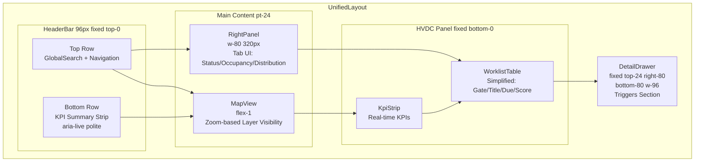
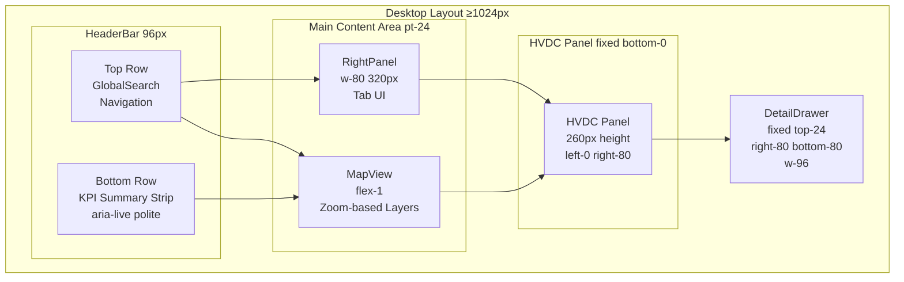
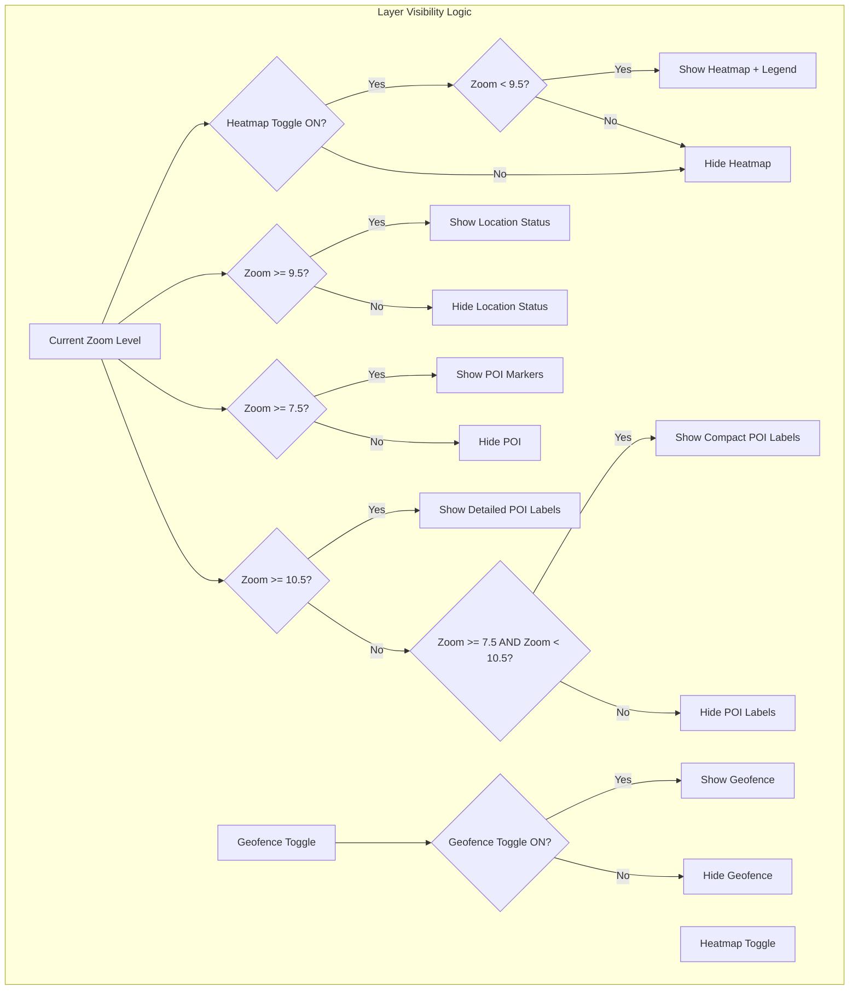
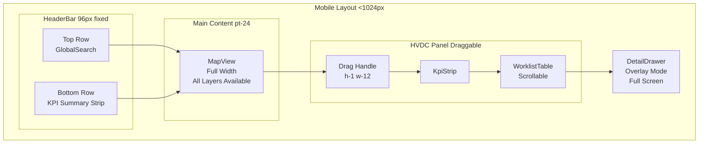
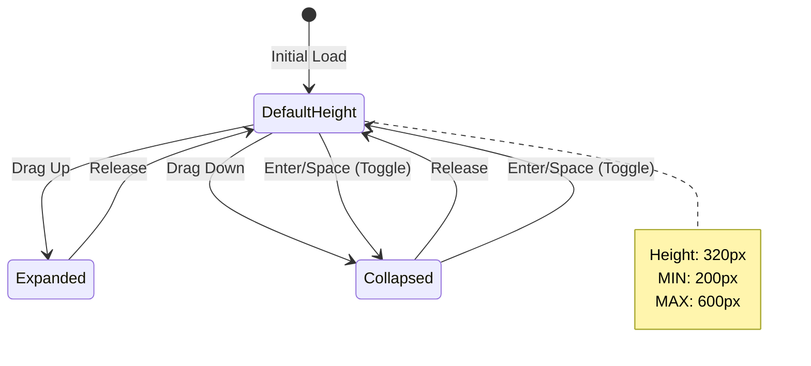
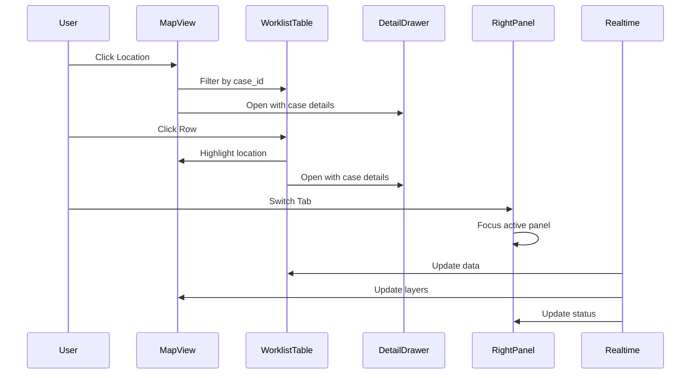
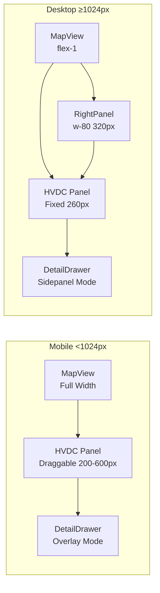
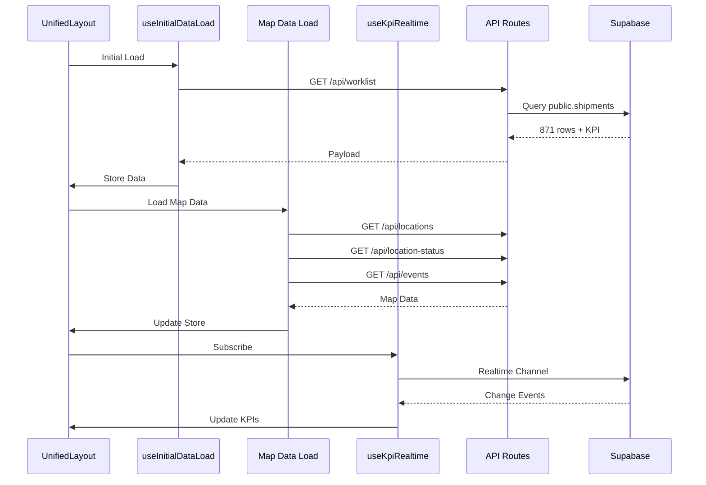

# 대시보드 전체 레이아웃 문서

> **HVDC + Logistics 통합 대시보드 레이아웃 사양**  
> **최종 업데이트**: 2026-02-07  
> **구현 파일**: `apps/logistics-dashboard/components/UnifiedLayout.tsx`

---

## 📐 레이아웃 개요

### 핵심 원칙 (레이아웃 불변)

통합 대시보드는 **3패널 레이아웃**을 기본으로 하며, 다음 구조를 유지합니다:

### 레이아웃 구조 다이어그램



```
┌─────────────────────────────────────────────────────────────┐
│  HeaderBar (고정, 높이: 96px, 2행 구조)                      │
│  - 상단: GlobalSearch (검색창)                               │
│  - 하단: KPI 요약 스트립 (고정, aria-live="polite")          │
├─────────────────────────────────────────────────────────────┤
│                                                              │
│  ┌──────────────────────┬──────────────────────────────┐   │
│  │                      │                              │   │
│  │   MapView (좌측)     │   RightPanel (우측)          │   │
│  │   - flex-1           │   - w-80 (320px)              │   │
│  │   - min-w-0          │   - shrink-0                 │   │
│  │   - POI Layer        │   - Desktop only (lg:block)  │   │
│  │   - Location Layer   │                              │   │
│  │   - Heatmap Layer    │                              │   │
│  │   - Geofence Layer   │                              │   │
│  │   - ETA Wedge Layer  │                              │   │
│  │                      │                              │   │
│  └──────────────────────┴──────────────────────────────┘   │
│                                                              │
│  ┌──────────────────────────────────────────────────────┐ │
│  │  HVDC Panel (하단)                                    │ │
│  │  - 고정 위치 (fixed bottom-0)                         │ │
│  │  - 높이: 260px (기본, 조절 가능)                       │ │
│  │  ┌────────────────────────────────────────────────┐ │ │
│  │  │  StageCardsStrip (상단, 3카드)                  │ │ │
│  │  └────────────────────────────────────────────────┘ │ │
│  │  ┌────────────────────────────────────────────────┐ │ │
│  │  │  KpiStrip (실시간 KPI)                         │ │ │
│  │  └────────────────────────────────────────────────┘ │ │
│  │  ┌────────────────────────────────────────────────┐ │ │
│  │  │  WorklistTable (하단, 스크롤 가능)              │ │ │
│  │  └────────────────────────────────────────────────┘ │ │
│  └──────────────────────────────────────────────────────┘ │
└─────────────────────────────────────────────────────────────┘
```

### 레이아웃 불변 규칙

1. **MapView는 항상 좌측에 위치** (flex-1로 남은 공간 차지)
2. **RightPanel은 데스크탑에서만 우측에 표시** (lg:block)
3. **HVDC Panel은 항상 하단에 고정** (fixed positioning)
4. **모바일에서는 RightPanel이 숨겨지고 HVDC Panel이 드래그 가능**

---

## 🖥️ 데스크탑 레이아웃 (≥1024px)

### 레이아웃 구조



```
┌─────────────────────────────────────────────────────────────┐
│  HeaderBar (96px, 2행 구조)                                  │
│  - 상단: GlobalSearch, 네비게이션                            │
│  - 하단: KPI 요약 스트립 (고정)                              │
├─────────────────────────────────────────────────────────────┤
│                                                              │
│  ┌──────────────────────────┬──────────────────────────┐   │
│  │                          │                          │   │
│  │   MapView                │   RightPanel              │   │
│  │   (flex-1, 남은 공간)    │   (320px 고정)            │   │
│  │                          │   (Tab UI)                │   │
│  │   - Location Layer       │   - Status Tab            │   │
│  │   - Heatmap Layer        │   - Occupancy Tab         │   │
│  │   - Geofence Layer       │   - Distribution Tab      │   │
│  │   - ETA Wedge Layer      │                          │   │
│  │   - POI Layer            │                          │   │
│  │                          │                          │   │
│  └──────────────────────────┴──────────────────────────┘   │
│                                                              │
│  ┌──────────────────────────────────────────────────────┐ │
│  │  HVDC Panel (260px 높이)                              │ │
│  │  ┌────────────────────────────────────────────────┐ │ │
│  │  │  KpiStrip (상단, 고정)                          │ │ │
│  │  │  - 실시간 KPI 지표                              │ │ │
│  │  │  - ConnectionStatusBadge                        │ │ │
│  │  └────────────────────────────────────────────────┘ │ │
│  │  ┌────────────────────────────────────────────────┐ │ │
│  │  │  WorklistTable (하단, 스크롤 가능)              │ │ │
│  │  │  - Gate/Title/Due/Score만 표시                  │ │ │
│  │  │  - 상세는 DetailDrawer                          │ │ │
│  │  └────────────────────────────────────────────────┘ │ │
│  └──────────────────────────────────────────────────────┘ │
│                                                              │
│  ┌──────────────────────────────────────────────────────┐ │
│  │  DetailDrawer (우측 상단, 오버레이)                   │ │
│  │  - mode: "sidepanel"                                │ │
│  │  - 위치: top-24 right-80 bottom-80 w-96              │ │
│  │  - Triggers 섹션 포함                                │ │
│  └──────────────────────────────────────────────────────┘ │
└─────────────────────────────────────────────────────────────┘
```

### 패널 상세

#### 1. HeaderBar
- **위치**: 최상단 고정
- **높이**: 96px (2행 구조, pt-24)
- **구조**:
  - 상단 행: GlobalSearch, 네비게이션, 사용자 메뉴, 설정
  - 하단 행: KPI 요약 스트립 (고정, `aria-live="polite"`)
- **기능**: 
  - 네비게이션
  - 사용자 메뉴
  - 설정
  - 실시간 KPI 요약 표시

#### 2. MapView (좌측)
- **위치**: 메인 영역 좌측
- **크기**: flex-1 (남은 공간 차지)
- **최소 너비**: min-w-0 (오버플로우 방지)
- **레이어**:
  - Location Layer (위치 마커)
  - Heatmap Layer (밀도 히트맵)
  - Geofence Layer (지오펜스 경계)
  - ETA Wedge Layer (ETA 예측 웨지)
  - POI Layer (고정 POI 마커 및 라벨)
- **인터랙션**:
  - 클릭: 위치 선택 → Worklist 필터 적용
  - 줌/팬: 표준 지도 제스처
  - 하이라이트: 선택된 케이스 강조
- **레이어 가시성 (줌 기반 + 토글 충돌 방지 기준)**:



**레이어 가시성 규칙**:
  - **Heatmap**: 줌 < 9.5일 때 표시. Heatmap 토글이 **켜져 있을 때만** 활성화됨. 히트맵 강도 범례 표시 (낮음~매우 높음).
  - **Location(Status)**: 줌 ≥ 9.5일 때 표시.
  - **POI 마커**: 줌 ≥ 7.5일 때 표시.
  - **POI 라벨**: 줌 7.5~10.5 구간에서는 **코드만** 표시 (컴팩트 모드), 줌 ≥ 10.5에서는 상세 라벨 표시 (상세 모드).
  - **Geofence**: 줌과 무관하게 토글 상태를 우선하며, Heatmap/Status 전환과 충돌하지 않음.
  - **토글 우선순위**: **사용자 토글 OFF → 항상 숨김**, **토글 ON → 줌 조건 충족 시 표시**.
  - **히트맵 반경**: 줌 레벨에 따라 스케일링 (밀도 표현 최적화)

#### 3. RightPanel (우측, Desktop only)
- **위치**: 메인 영역 우측
- **크기**: w-80 (320px 고정)
- **표시 조건**: lg:block (≥1024px)
- **구조**: 탭 UI (Status/Occupancy/Distribution)
- **내용**:
  - Status 탭: Location Status (위치 상태 정보), Event List (이벤트 목록)
  - Occupancy 탭: Occupancy Chart (점유율 차트)
  - Distribution 탭: Distribution Chart (분포 차트)
  - 접근성: 활성 탭에 포커스 자동 이동 (`activeTab`, `activePanel?.focus()`)

#### 4. HVDC Panel (하단)
- **위치**: 화면 하단 고정 (fixed bottom-0)
- **크기**: 
  - 너비: left-0 right-80 (RightPanel 제외)
  - 높이: 기본 260px (DEFAULT_PANEL_HEIGHT), 조절 가능
- **구조**:
  - KpiStrip (상단, 고정)
  - WorklistTable (하단, 스크롤 가능)
    - 간소화된 컬럼: Gate, Title, Due, Score만 표시
    - 상세 정보는 DetailDrawer에서 확인 (Triggers 포함)
- **Z-index**: z-40

#### 5. DetailDrawer (우측 상단, 오버레이)
- **위치**: fixed top-24 right-80 bottom-80 w-96 (레이아웃 간격 조정 반영)
- **모드**: "sidepanel" (데스크탑)
- **표시 조건**: 선택된 케이스가 있을 때
- **내용**: 
  - 케이스 상세 정보
  - Flow Code 정보
  - Triggers 섹션 (워크리스트에서 이동)
- **Z-index**: z-50

---

## 📱 모바일 레이아웃 (<1024px)

### 레이아웃 구조 다이어그램



### 레이아웃 구조

```
┌─────────────────────────────────────┐
│  HeaderBar (96px, 2-row)           │
│  - 상단: GlobalSearch               │
│  - 하단: KPI 요약 스트립             │
├─────────────────────────────────────┤
│                                     │
│  ┌───────────────────────────────┐ │
│  │                               │ │
│  │   MapView (전체 너비)          │ │
│  │   - flex-1                    │ │
│  │   - Location Layer            │ │
│  │   - Heatmap Layer             │ │
│  │   - Geofence Layer           │ │
│  │   - ETA Wedge Layer          │ │
│  │   - POI Layer                │ │
│  │                               │ │
│  └───────────────────────────────┘ │
│                                     │
│  ┌───────────────────────────────┐ │
│  │  ═══ (드래그 핸들)              │ │
│  │  HVDC Panel (드래그 가능)       │ │
│  │  - 높이: 200-600px (조절 가능)  │ │
│  │  - 기본: 320px                 │ │
│  │  ┌─────────────────────────┐ │ │
│  │  │  KpiStrip               │ │ │
│  │  └─────────────────────────┘ │ │
│  │  ┌─────────────────────────┐ │ │
│  │  │  WorklistTable (스크롤)  │ │ │
│  │  └─────────────────────────┘ │ │
│  └───────────────────────────────┘ │
│                                     │
│  ┌───────────────────────────────┐ │
│  │  DetailDrawer (오버레이)       │ │
│  │  - mode: "overlay"            │ │
│  │  - 전체 화면 덮음              │ │
│  └───────────────────────────────┘ │
└─────────────────────────────────────┘
```

### 모바일 특화 기능

#### 1. HVDC Panel 드래그 제스처



- **드래그 핸들**: 상단 중앙의 회색 바 (h-1, w-12)
- **높이 범위**: 200px (MIN) ~ 600px (MAX)
- **기본 높이**: 320px (DEFAULT)
- **제스처**:
  - 위로 드래그: 패널 확대
  - 아래로 드래그: 패널 축소
  - 키보드: Enter/Space로 토글 (최소/기본 높이)
- **터치 지원**: touchstart, touchmove, touchend

#### 2. RightPanel 숨김
- 모바일에서는 RightPanel이 완전히 숨겨짐 (lg:hidden)
- 위치 정보는 DetailDrawer에서 확인 가능

#### 3. DetailDrawer 오버레이 모드
- **모드**: "overlay"
- **표시**: 전체 화면을 덮는 모달 형태
- **닫기**: ESC 키 또는 배경 클릭

---

## 🧩 컴포넌트 계층 구조

### 컴포넌트 계층 다이어그램

```mermaid
graph TD
    UnifiedLayout[UnifiedLayout.tsx]
    
    UnifiedLayout --> HeaderBar[HeaderBar<br/>96px, 2-row layout]
    UnifiedLayout --> MapView[MapView Component<br/>Zoom-based Layers]
    UnifiedLayout --> RightPanel[RightPanel Component<br/>Tab UI]
    UnifiedLayout --> HVDCPanel[HVDC Panel Component<br/>260px height]
    UnifiedLayout --> DetailDrawer[DetailDrawer Component<br/>Triggers Section]
    
    HeaderBar --> HeaderTop[Top Row<br/>GlobalSearch + Navigation]
    HeaderBar --> HeaderBottom[Bottom Row<br/>KPI Summary Strip]
    
    MapView --> LocationLayer[Location Layer<br/>deck.gl ScatterplotLayer<br/>Zoom >= 9.5]
    MapView --> HeatmapLayer[Heatmap Layer<br/>deck.gl HeatmapLayer<br/>Zoom < 9.5 + Legend]
    MapView --> GeofenceLayer[Geofence Layer<br/>deck.gl PathLayer]
    MapView --> ETAWedgeLayer[ETA Wedge Layer<br/>deck.gl ArcLayer]
    MapView --> PoiLayer[POI Layer<br/>deck.gl ScatterplotLayer + TextLayer<br/>Zoom >= 7.5, Compact/Detailed Labels]
    MapView --> HeatmapLegend[HeatmapLegend<br/>Intensity Scale]
    
    RightPanel --> TabUI[Tab UI<br/>Status/Occupancy/Distribution]
    TabUI --> StatusTab[Status Tab<br/>Location Status + Event List]
    TabUI --> OccupancyTab[Occupancy Tab<br/>Occupancy Chart]
    TabUI --> DistributionTab[Distribution Tab<br/>Distribution Chart]
    
    HVDCPanel --> StageCardsStrip[StageCardsStrip<br/>3 Cards, Routing]
    HVDCPanel --> KpiStrip[KpiStrip<br/>Real-time KPIs]
    HVDCPanel --> WorklistTable[WorklistTable<br/>Simplified Columns]
    
    WorklistTable --> WorklistRow[WorklistRow<br/>Gate/Title/Due/Score]
    WorklistTable --> FilterBar[FilterBar]
    
    DetailDrawer --> CaseDetails[Case Details]
    DetailDrawer --> FlowCodeInfo[Flow Code Info]
    DetailDrawer --> TriggersSection[Triggers Section]
```



### 텍스트 계층 구조

```
UnifiedLayout
├── HeaderBar (96px, 2-row)
│   ├── Top Row: GlobalSearch + Navigation
│   └── Bottom Row: KPI Summary Strip
├── MapView (좌측)
│   ├── Location Layer (deck.gl, Zoom ≥9.5)
│   ├── Heatmap Layer (deck.gl, Zoom <9.5 + Legend)
│   ├── Geofence Layer (deck.gl)
│   ├── ETA Wedge Layer (deck.gl)
│   ├── POI Layer (deck.gl, Zoom ≥7.5)
│   └── HeatmapLegend (Intensity Scale)
├── RightPanel (우측, Desktop only)
│   └── Tab UI
│       ├── Status Tab: Location Status + Event List
│       ├── Occupancy Tab: Occupancy Chart
│       └── Distribution Tab: Distribution Chart
├── HVDC Panel (하단, 260px)
│   ├── StageCardsStrip (3 Cards)
│   ├── KpiStrip
│   │   ├── ConnectionStatusBadge
│   │   └── KPI Cards
│   └── WorklistTable
│       ├── Filter Controls
│       └── Table Rows (Gate/Title/Due/Score)
└── DetailDrawer
    ├── Case Details
    ├── Flow Code Info
    └── Triggers Section
```

---

## 🔄 상호작용 및 동기화

### 상호작용 플로우 다이어그램



### 1. Map ↔ Worklist 동기화

**Map 클릭 시**:
1. 선택된 위치의 `case_id` 추출
2. WorklistTable에 필터 적용 (`selected_case_id`)
3. DetailDrawer 열기 (해당 케이스 상세 정보)

**Worklist Row 클릭 시**:
1. 선택된 케이스의 `case_id` 추출
2. MapView에서 해당 위치 하이라이트
3. DetailDrawer 열기 (케이스 상세 정보)

### 2. 필터 동기화

- **Gate 필터**: Map 색상, Worklist 표시, KPI 계산에 동시 반영
- **Site 필터**: Map 마커, Worklist 행, RightPanel 상태에 반영
- **Time Window**: 모든 패널의 데이터 범위 조정

### 3. Realtime 업데이트

- **KPI 업데이트**: Supabase Realtime → KpiStrip 자동 갱신
- **Worklist 업데이트**: DB 변경 → WorklistTable 자동 갱신
- **Map 업데이트**: Location Status 변경 → MapView 레이어 갱신

---

## ♿ 접근성 (WCAG 2.2 AA)

### 키보드 네비게이션

- **Tab**: 모든 인터랙티브 요소 순차 이동
- **Enter/Space**: 버튼/링크 활성화
- **ESC**: DetailDrawer 닫기, 모달 닫기
- **화살표 키**: WorklistTable 행 이동 (향후 구현)

### ARIA 레이블

- `role="main"`: MapView
- `aria-label="Logistics Map View"`: MapView
- `aria-label="Location Status Panel"`: RightPanel
- `aria-label="HVDC Worklist Panel"`: HVDC Panel
- `aria-label="Drag to resize panel"`: 드래그 핸들

### 포커스 관리

- DetailDrawer 열릴 때: 포커스 트랩 (향후 구현)
- DetailDrawer 닫힐 때: 이전 포커스로 복귀
- 모바일 패널 드래그: 키보드 접근 가능 (Enter/Space)

### 색상 대비

- **기본**: 다크 모드 (WCAG AA 기준 충족)
- **타이포그래피**: 
  - 기본 폰트 크기: 16px (html { font-size: 16px; })
  - 주요 라벨: text-sm (14px)
  - 대비 개선: `--muted-foreground` oklch(0.72 0 0) (가독성 향상)
- **상태 색상**:
  - OK: Green (#22c55e, 대비 4.5:1 이상)
  - Warning: Amber (#f59e0b, 대비 4.5:1 이상)
  - Critical: Red (#ef4444, 대비 4.5:1 이상)

---

## 📏 반응형 브레이크포인트

### 반응형 레이아웃 다이어그램



### Tailwind CSS 기준

- **모바일**: < 1024px (lg 미만)
  - MapView: 전체 너비
  - RightPanel: 숨김
  - HVDC Panel: 드래그 가능, 하단 고정 (200-600px)

- **데스크탑**: ≥ 1024px (lg 이상)
  - MapView: flex-1 (남은 공간)
  - RightPanel: w-80 (320px) 표시
  - HVDC Panel: 고정 높이 (260px)

---

## 🎨 스타일 가이드

### 색상 시스템

- **배경**: `bg-background` (다크 모드 기본)
- **카드**: `bg-card` (패널 배경)
- **테두리**: `border-border` (구분선)
- **텍스트**: `text-foreground` (기본 텍스트)

### 간격 시스템

- **패널 패딩**: p-4 (16px)
- **패널 간격**: border-b (구분선)
- **헤더 높이**: 96px (pt-24, 2행 구조)
- **메인 콘텐츠 상단 여백**: pt-24 (헤더 높이 반영)
- **데스크탑 하단 여백**: lg:pb-96 (HVDC 패널 겹침 방지)

### Z-index 계층

- **HeaderBar**: z-10 (기본)
- **HVDC Panel**: z-40 (패널)
- **DetailDrawer**: z-50 (오버레이)

---

## 🔧 구현 세부사항

### 상태 관리

- **Zustand Store**: `useOpsActions()` 사용
- **상태**:
  - `selectedCaseId`: 선택된 케이스 ID
  - `selectedLocationId`: 선택된 위치 ID
  - `drawerOpen`: DetailDrawer 열림/닫힘
  - `filters`: Gate, Site, Time Window 필터

### 데이터 로딩



- **초기 로드**: `useInitialDataLoad` 훅
  - Worklist/KPI 데이터 먼저 로드
  - Realtime 구독 전에 완료
- **Map 데이터**: 별도 로드
  - Locations, LocationStatuses, Events
- **Realtime**: `useLiveFeed` 훅
  - KPI 업데이트는 `useKpiRealtime` 사용

### 성능 최적화

- **지도 레이어**: 동적 로딩 (필요 시만)
- **가상화**: WorklistTable 대용량 데이터 가상화 (향후)
- **배치 업데이트**: Realtime 이벤트 배치 처리 (300-500ms)

---

## 📋 체크리스트

### 레이아웃 불변 검증

- [x] MapView는 항상 좌측에 위치
- [x] RightPanel은 데스크탑에서만 표시
- [x] HVDC Panel은 항상 하단에 고정
- [x] 모바일에서 RightPanel 숨김
- [x] 모바일에서 HVDC Panel 드래그 가능

### 접근성 검증

- [x] ESC 키로 DetailDrawer 닫기
- [x] ARIA 레이블 적용
- [x] 키보드 네비게이션 기본 지원
- [ ] 포커스 트랩 (DetailDrawer)
- [ ] 화살표 키 네비게이션 (WorklistTable)

### 상호작용 검증

- [ ] Map 클릭 → Worklist 필터 적용
- [ ] Worklist Row 클릭 → Map 하이라이트
- [ ] 필터 변경 → 모든 패널 동기화
- [ ] Realtime 업데이트 → 자동 갱신

---

## 📚 참조 문서

- [STATUS.md](../STATUS.md) - 통합 상태 SSOT
- [INTEGRATION_ROADMAP.md](../integration/INTEGRATION_ROADMAP.md) - 통합 로드맵
- [COMPONENT_SPEC.md](../../.cursor/skills/unified-dashboard-ui/references/COMPONENT_SPEC.md) - 컴포넌트 사양
- [REALTIME_IMPLEMENTATION.md](./REALTIME_IMPLEMENTATION.md) - Realtime 구현 가이드

---

**최종 업데이트**: 2026-02-07

**최근 변경사항** (2026-02-05~2026-02-07):
- 히트맵 강도 범례 추가 (낮음~매우 높음)
- 줌 기반 레이어 가시성 구현 (히트맵/상태/POI 레이어 동적 표시)
- POI 라벨 컴팩트/상세 모드 전환
- RightPanel 탭 UI (Status/Occupancy/Distribution)
- 타이포그래피 개선 (기본 폰트 16px, text-sm 기준, 대비 향상)
- KPI 요약 스트립 헤더 고정 (2행 구조)
- 레이아웃 간격 조정 (HVDC 패널 겹침 방지)
- HVDC 워크리스트 간소화 (핵심 컬럼만, 상세는 DetailDrawer)
